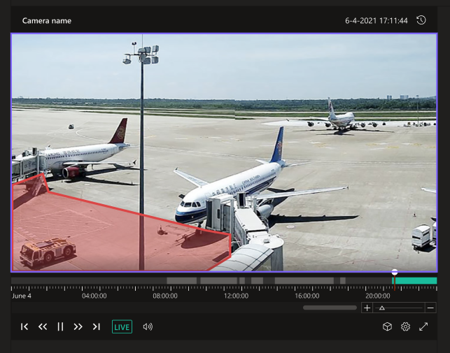

# Azure video analyzer widgets

[](https://opensource.org/licenses/MIT)
[](https://www.typescriptlang.org/)
[](https://github.com/prettier/prettier)

This is the Azure video analyzer widgets repo, containing web component packages, examples, and documentation.

## Introduction

A collection of widgets (web components) using Azure Video Analyzer platform capabilities and APIs

## Prerequisites
###### NOTE: this is relevant during development mode. After releasing to GITHUB, the flow will be updated.

1.	#### For consuming at runtime:
    In this option, you can **build the library yourself** or **import the build library from a blob**.
    _For building AVA widgets library_, please make sure you have access to the following repo - [AVA-Widgets](https://dev.azure.com/MediaWidgets/AVA%20Widgets)
    If not, please reach out to @Nofar Edan or @Ori Ziv to get access.

    _For importing the library from a blob_, please make sure you have access to the following file:  https://salmon-mushroom-072389f0f.azurestaticapps.net/scripts.js 

2.	#### For consuming as NPM package from Azure private feed: 
    Access to feed: please make sure you have access to [Media-AVA-Widgets](https://dev.azure.com/MediaWidgets/AVA%20Widgets/_packaging?_a=feed&feed=Media-AVA-Widgets) private feed: 

    Connect to Media-AVA-widgets feed:
    a.	Enter [Media-AVA-Widgets](https://dev.azure.com/MediaWidgets/AVA%20Widgets/_packaging?_a=feed&feed=Media-AVA-Widgets) 
    b.	Click on ‘Connect to feed’
    C.  Select 'npm'
    d.  Follow installation steps. 

## Installing AVA library
###### NOTE: this is relevant during development mode. After releasing to GITHUB, the flow will be updated.

1.	#### For consuming at runtime:
    _Build ava widgets library_-
        a.	Clone repo code: [AVA-Widgets](https://dev.azure.com/MediaWidgets/AVA%20Widgets)
        b.	Once cloned, enter repository location and write the following commands:
            ```
            npm install
            npm run build
            ```
            Once build is done, enter _/dist_ folder, there you will find _ava-widgets-sdk.js_ file.

    _For importing from a blob option, you can skip this step._

2.	#### For consuming as NPM package from Azure private feed: 
    a.  Create in your application an _.npmrc_ file and follow the steps in . [Prerequisites/2](/Prerequisites/2) 
    b.  Install the library:
        ```
            npm install @video-analyzer/widgets
        ```

### `RVX player widget`
#### Import
##### Native JS usage:

Import ava-widgets-sdk.js / https://salmon-mushroom-072389f0f.azurestaticapps.net/scripts.js to your HTML file:
```html live
    <head>
        <script async type=”module” src="./ava-widgets-sdk.js"></script>
    </head>
    …
    …
```

```html live
   <head>
    <script async type=”module” src="https://salmon-mushroom-072389f0f.azurestaticapps.net/scripts.js"></script>
    </head>
    …
    …
```

##### Typescript usage:

``` 
import { RVXWidget } from '@video-analytics/widgets';
```

#### Getting Started
RVX widget is a web-component that can be created using HTML or dynamically. 

Creating using HTML:
```html live
  <head>
	…
 	..
  <body>
	<rvx-widget><rvx-widget>
  </body>
```

Creating dynamically:

##### Native JS usage:
```html live
  <head>
    <script async type=”module” src="https://salmon-mushroom-072389f0f.azurestaticapps.net/scripts.js"></script>
  </head>
  <body>
	…
  </body>
  <script>(function () {
            const rvxWidget = new window.ava.widgets.rvx();
            document.firstElementChild.appendChild(rvxWidget)
  })()
</script>
```

##### Typescript usage:
``` 
import { RVXWidget } from '@video-analytics/widgets';

const rvxWidget = new RVXWidget();
document.firstElementChild.appendChild(RVXWidget).
```

#### Properties
Name | Type | Default | Description 
------------ | ------------- | ------------- | -------------
width	| string	         | 100%	| Reflects the value of widget width.
height	| string	         | 100%	| Reflects the value of widget height
config	| IRVXWidgetConfig	 | null	| Widget configuration

#### Events
Name | Parameters | Description 
------------ | ------------- | -------------
TOKEN_EXPIRED	| -	         | Callback to invoke when AVA JWT token is expired.

#### Methods
Name | Parameters | Description 
------------ | ------------- | -------------
constructor 	| width: string = '', height: string = '', config: IRVXWidgetConfig = null	| Widget constructor. If called with config, you don’t need to call _configure_ function
setAccessToken	| jwtToken:string	| Update the widget token. 
set apiBase	    | apiBase:string	| Control AVA-API base. Good for using mock API / testing API.
configure	    | config: IRVXWidgetConfig	| Update widget configuration.
load	        | -	                | Loads and initialize the widget according to provided configuration. If not called, widget will be empty  


#### Code snippets: